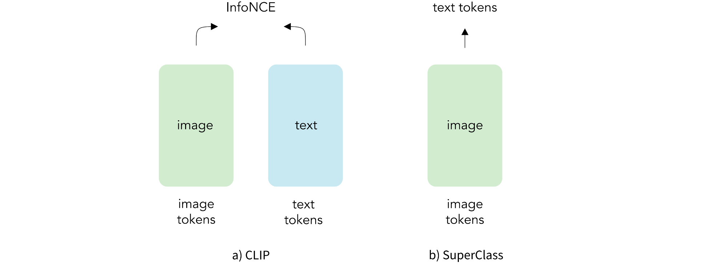

<div align="center">
<h2>SuperClass: Classification Done Right for Vision-Language Pre-Training</h2>

[**Zilong Huang**](http://speedinghzl.github.io/) · [**Qinghao Ye**](https://scholar.google.com/citations?user=ZYOhaGwAAAAJ&hl=zh-CN)  ·  [**Bingyi Kang**](https://bingykang.github.io/) ·  [**Jiashi Feng**](https://sites.google.com/site/jshfeng/) · [**Haoqi Fan**](https://scholar.google.com/citations?user=76B8lrgAAAAJ&hl=en)

Bytedance Research 

<a href=""></a>


</div>

This work presents SuperClass, a super simple classification method that performs vision-language pre-training. Our method does **not require a text encoder** to be pre-trained on image-text data. Instead, it utilizes **tokenized raw text** as **supervised classification labels**, without the need for additional text filtering or selection.

<div align="center">
  
</div>


## News

- **2024-11-06:** Paper & code are all released.
- **2024-10-02:** SuperClass is accepted by NeurIPS 2024.


## Usage

### Prepraration

```bash
git clone https://github.com/x-cls/superclass
cd superclass
pip install -r requirements.txt
```

Download the datasets [Datacomp-1B](https://github.com/mlfoundations/datacomp) and [ImageNet-1K](https://www.image-net.org/download.php).

Modify the **DATA_PATH** and **VAL_DATA_PATH** in training script **train.sh** and **train_combo.sh** to your local paths to Datacomp-1B and ImageNet-1K.


### CLIP Training & Superclass Training

To start CLIP training and superclass training, use the following command:

```bash
bash train.sh <config_path> opencls
```

This script will navigate to the opencls directory and execute the training.

If you want to include the LiT training phase, use the following command:

```bash
bash train_combo.sh <cls_config_path> <lit_config_path> opencls
```

CLS training config are here `opencls/configs/cls_schedule`


For example:
```bash
bash train.sh configs/cls_schedule/cls_vit_b16_s1.28B_bs16k.yaml opencls
```


## Acknowledgement
Our codebase is built up on [OpenCLIP](https://github.com/mlfoundations/open_clip) and the [ViTamin](https://github.com/Beckschen/ViTamin).

We thank the [OpenCLIP](https://github.com/mlfoundations/open_clip) and the [ViTamin](https://github.com/Beckschen/ViTamin) for contributing such impressive codes and models to our community.


## LICENSE

The models & code of SuperClass are released under the Apache-2.0 license.


## Citation

If you find this project useful, please consider citing:

```bibtex
@inproceedings{superclass_huang,
  title={Classification Done Right for Vision-Language Pre-Training}, 
  author={Huang, Zilong and Ye, Qinghao and Kang, Bingyi and Feng, Jiashi and Fan, Haoqi},
  booktitle={NeurIPS},
  year={2024}
}
```
